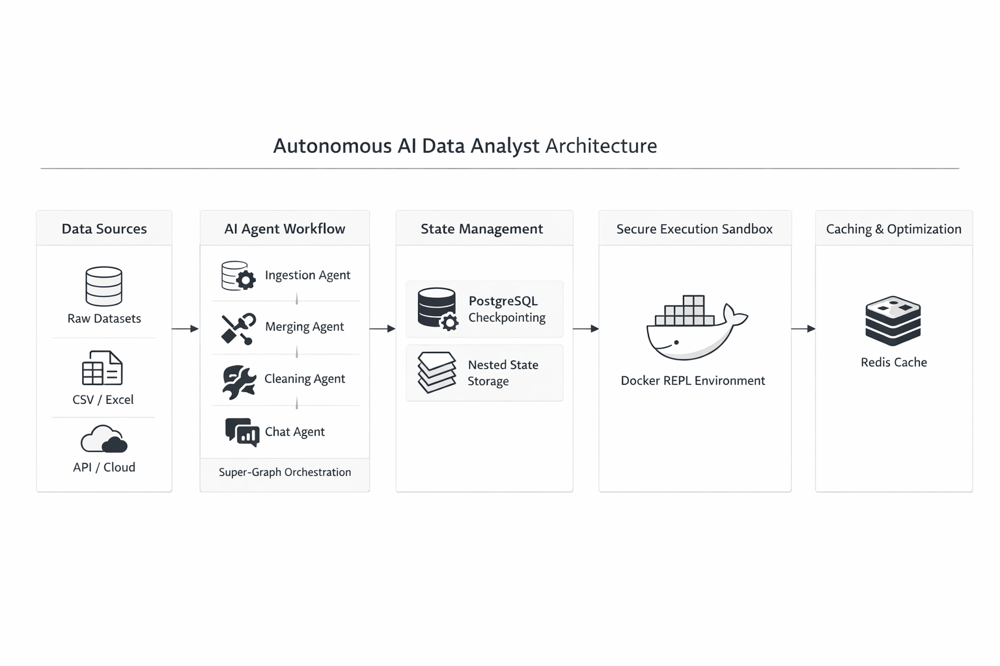
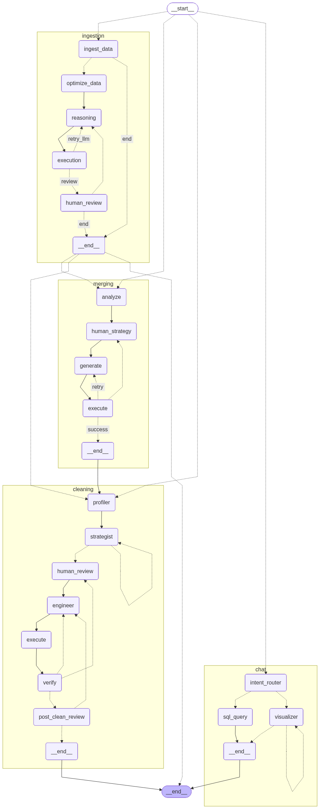
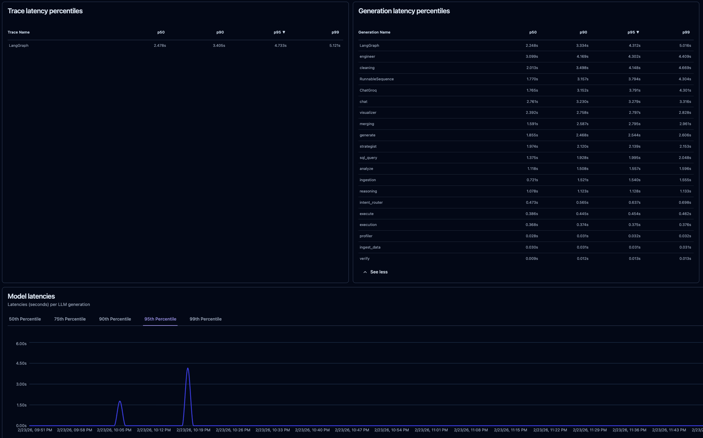
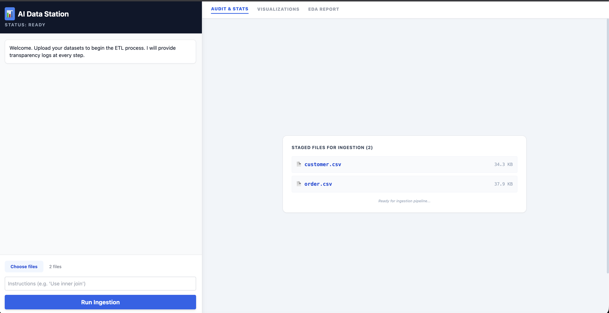

# AI Data Analyst Agent

## 1. Executive Summary

The AI Data Analyst is an advanced, multi-agent orchestrator designed to fully automate the Extract, Transform, Load (ETL) lifecycle and provide an interactive, natural language data analysis engine. Built on a hierarchical "Graph of Graphs" architecture using LangGraph, the system dynamically routes workflows through ingestion, dataset merging, enterprise-grade data cleaning, and final data visualization. By combining the reasoning capabilities of Large Language Models (LLMs) with strict Pydantic validation, process-level sandboxing, and in-memory DuckDB SQL execution, the system bridges the gap between raw, messy files and actionable business intelligence without requiring a human data engineer to write a single line of code.

## 2. Key Features & Engineering Highlights

This framework goes beyond standard LLM API wrappers by implementing robust software engineering patterns:

* **Autonomous Self-Healing & Code Correction:** If the LLM generates invalid Python code, throws a Pandas traceback error, or accidentally drops rows, the system automatically intercepts the error, truncates the stack trace, restores the dataset from a `.bak` backup, and feeds the error context back to the LLM to rewrite and fix the code natively.
* **Human-In-The-Loop (HITL) Pausing:** The system uses asynchronous PostgreSQL checkpointing to pause execution at critical decision points (e.g., dataset merging strategies or cleaning plan approval), wait for human feedback via FastAPI, and seamlessly resume the workflow.
* **Zero-Copy In-Memory SQL (DuckDB):** Instead of migrating data to an external relational database, the chat agent utilizes DuckDB to execute high-speed SQL queries directly against the in-memory Pandas dataframes, enabling massive performance gains and preventing hallucinations associated with LLM-generated Pandas logic.
* **Dual-Model Routing:** Employs an 8B model for lightning-fast, low-cost intent classification (routing between SQL queries vs. Python visualizations) and a 70B model for heavy logical reasoning and code generation.
* **Strict Enterprise Guardrails:** Forces the LLM to output structured JSON cleaning plans (via Pydantic) that enforce strict rules, such as a complete ban on destructive operations like `dropna()`, mandating median/imputation strategies instead.
* **Process-Level Sandboxing:** Executes untrusted, LLM-generated Python code inside an isolated `DockerREPL` subprocess with strict 60-second timeouts to prevent infinite loops and server crashes.
* **Redis Exact-Match Caching:** Intercepts identical prompts and self-correction loops at the LangChain layer, serving instant responses from RAM to drastically reduce latency and API costs.

---

## High-Level Architecture Diagram

  

## 3. System Architecture & Tech Stack

* **Orchestration & State:** LangGraph (Hierarchical StateGraph), PostgreSQL (Async Checkpointing).
* **Backend & Routing:** FastAPI, Uvicorn, Python `subprocess` (Sandbox).
* **Intelligence & Tooling:** Groq API (Llama 3.3 70B & Llama 3.1 8B), LangChain, Pydantic.
* **Data Processing & SQL:** Pandas, Numpy, DuckDB.
* **Observability & Telemetry:** Langfuse (Callback tracking).

---

## 4. Phase-by-Phase Execution Workflow

### Phase 1: Ingestion & Memory Optimization

The entry point handles file uploads, standardizing them for the pipeline while protecting host memory.

* **Hashing & Caching:** Incoming files are hashed (SHA-256). If a file has been processed previously, the system utilizes the cached version, skipping redundant I/O operations.
* **Pickle Serialization:** CSVs are immediately converted to `.pkl` files, exponentially speeding up read/write speeds for downstream agents.
* **Automatic Downcasting:** Datasets exceeding 50,000 rows trigger an automatic optimization loop that identifies low-cardinality string columns and converts them to Pandas `category` types, drastically reducing the RAM footprint.
* **Non-Destructive Execution:** The LLM generates code to filter or standardize columns based on user intent, with strict system prompts preventing any row deletion or type casting at this early stage.

### Phase 2: Intelligent Merging & Auditing

When multiple datasets are present, the system negotiates a unified schema.

* **Fast Heuristic Scanning:** The 70B model analyzes column shapes and datatypes to propose a logical merge strategy (e.g., identifying primary/foreign key overlaps).
* **HITL Intervention:** Execution halts, yielding the proposed strategy to the client interface. The user can approve, modify, or skip the merge entirely.
* **Zero-Row Audit (Failsafe):** Once the LLM generates the Pandas `pd.merge()` code, the system executes it and audits the output. If a strict inner join results in 0 rows, the system flags a "CRITICAL AUDIT FAILURE," restores the unmerged backups, and forces the LLM to rewrite the code using an `outer` join.

### Phase 3: Structured Preprocessing & Cleaning

This phase transforms dirty data using rigorously validated, multi-step planning.

* **Deep Profiling:** The agent generates a comprehensive statistical map of the dataset, detecting hidden issues like "fake nulls" (e.g., `-999`, "N/A"), mixed currency formats requiring regex extraction, and datetime anomalies.
* **Pydantic Strategic Planning:** The LLM generates a `CleaningPlan` JSON object. If the JSON is malformed, a localized self-correction loop forces the LLM to fix the formatting. The plan explicitly enforces enterprise rules (e.g., handling redundant ID columns).
* **Procedural Code Generation:** The LLM translates the JSON plan into flat, procedural Python code utilizing bulletproof snippets (e.g., stripping whitespace, safely filling unknowns).
* **Execution Verification & Rollback:** The code is executed in the sandbox. If the code inadvertently drops rows or fails execution, the `verify_cleaning_node` catches the discrepancy, restores the `.bak` files, and initiates the self-healing loop by feeding the failure context back to the engineer node.

### Phase 4: Intent Routing, Chat, & Visualization

Post-ETL, the system serves as an interactive data analyst.

* **Intent Classifier:** An 8B model instantly classifies the user's natural language query as either `query` (mathematical/data retrieval) or `visualize` (chart generation).
* **SQL Generation (DuckDB):** For data retrieval, the system bypasses complex Pandas logic. DuckDB is wrapped around the in-memory dataframe, allowing the LLM to write standard, highly accurate SQL queries. The raw output is then fed back to the LLM to synthesize a natural language summary.
* **Visualizer Sandbox:** For chart requests, the LLM generates Python Matplotlib/Seaborn scripts. These are executed within the `DockerREPL`, and the resulting `.png` file paths are returned to the frontend.

---

## 5. Advanced Engineering Mechanisms

### The Self-Healing Loop (Code Correction)

The hallmark of this system is its resilience. Within the `MasterState`, an `iteration_count` and `error` key track execution health. If the `DockerREPL` catches an error:

1. The error trace is dynamically truncated to 15 lines (`_truncate_error`) to prevent context window bloat.
2. The graph loops back to the generation node.
3. The truncated error is injected as `{error_context}`, forcing the LLM to debug its own code natively.
4. If the loop fails 3 consecutive times, it safely exits to a human review node, preventing infinite API spend.

### Process-Level Security Sandboxing

To safely execute LLM-generated code, the `DockerREPL` isolates execution via `subprocess.run()`. Code is written to a temporary UUID-tagged file, executed natively with a strict 60-second timeout, and output (or stderr) is captured. This prevents rogue code from locking up the FastAPI event loop or executing malicious host commands.

### Async Checkpointing & State Persistence

By passing a `thread_id` from the client, the `AsyncPostgresSaver` rehydrates the `MasterState` from the PostgreSQL pool. This allows the ETL pipeline to run asynchronously, pause indefinitely for human input, and resume perfectly without losing file paths, profile statistics, or chat history.

---

## 6. Future Scalability & Architecture Upgrades

To transition this framework from gigabyte-scale to terabyte-scale processing, the following architectural upgrades are planned:

* **Polars & Parquet Migration (OOM Prevention):** Replacing Pandas and Pickle files with the Parquet file format and the Polars execution engine. This will enable lazy evaluation and out-of-core streaming, allowing the system to process datasets significantly larger than the host machine's RAM without crashing.
* **DuckDB Transformation Offloading:** Refactoring the preprocessing phase to utilize DuckDB SQL for data cleaning instead of Python/Pandas scripts, shifting the computational burden entirely to DuckDB's highly optimized, disk-spilling C++ engine.
* **Ephemeral Docker Integration:** Upgrading the `DockerREPL` from process-level isolation to the Docker SDK, spinning up dedicated, ephemeral, and network-disabled containers for every single code execution to ensure true multi-tenant enterprise security.

---

## 7 Performance & Latency Metrics

The system is heavily optimized for speed, utilizing Groq's LPU inference engine combined with asynchronous backend processing. Distributed tracing via Langfuse demonstrates highly competitive latencies for a multi-agent system:

* **Overall Graph Execution (LangGraph Trace)**:
* p50 Latency: 2.478s
* p90 Latency: 3.405s

* **LLM Generation Latency (ChatGroq)**:
* p50 Latency: 1.765s
* p90 Latency: 3.152s

* **Specialized Node Execution**:
* Intent Routing (Llama-3.1-8b): ~0.473s (p50)
* SQL Query Generation: ~1.375s (p50)
* Code Generation & Execution (Engineer Node): ~3.099s (p50)

---

## Langgraph Graph

  

## Langfuse Tracking

  

## Frontend Preview

  

